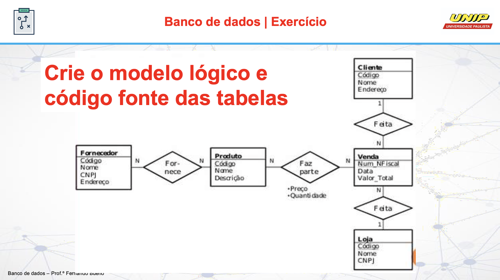
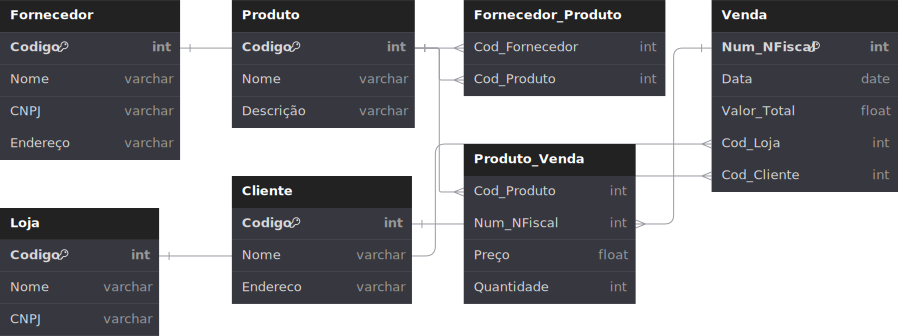

# Atividade - Criação de Modelo Lógico e Código Fonte (SQL) 🛠️

Na atividade em questão, foi proposta a criação de um banco de dados para uma loja, requerendo tanto a construção do modelo lógico quanto a escrita do código fonte necessário para implementá-lo.

---

## Tarefa ✅

1. Analisar o modelo conceitual fornecido.
2. Identificar as entidades, relacionamentos e atributos relevantes.
3. Transformar o modelo conceitual em um modelo lógico, definindo tabelas, chaves primárias, chaves estrangeiras e relacionamentos.
4. Elaborar um documento que represente o modelo lógico desenvolvido.
5. Criar um script do modelo lógico para futura implementação.

---

## Modelo Conceitual 📝

Segue o modelo conceitual fornecido como base para o desenvolvimento da atividade:


**_[Modelo fornecido pelo professor @buenopt](https://github.com/buenopt)_**

---

## Modelo Lógico - Desenvolvido 📊

O modelo lógico foi construído utilizando a aplicação web **_dbdiagram.io_**:


**_[Projeto no dbdiagram.io](https://dbdiagram.io/d/Tarefa-BD-66244d9203593b6b61858f0d)_**

---

## Script 💻

```sql

CREATE DATABASE Loja;

```

---

## Links 🔗

- [dbdiagram.io](https://www.dbdiagram.io/)
- [Projeto no dbdiagram.io](https://dbdiagram.io/d/Tarefa-BD-66244d9203593b6b61858f0d)